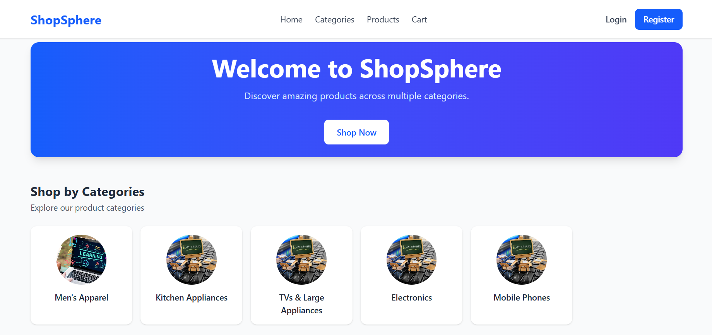
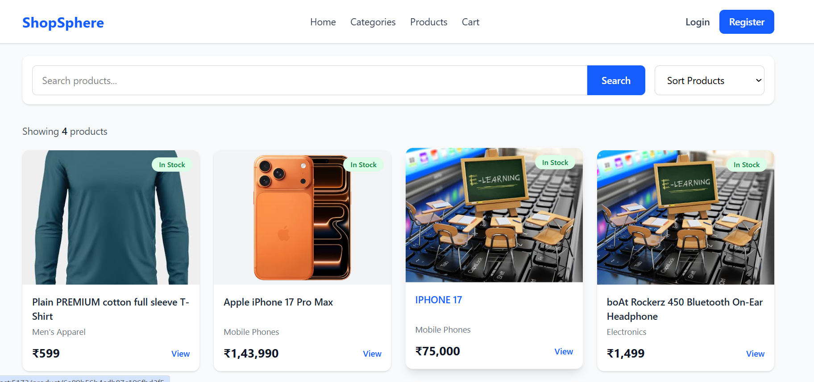
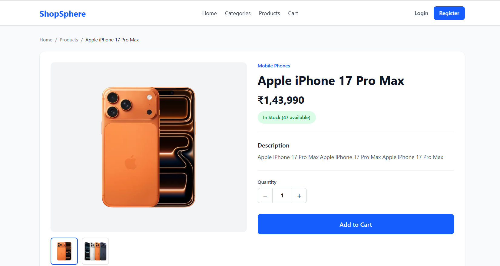
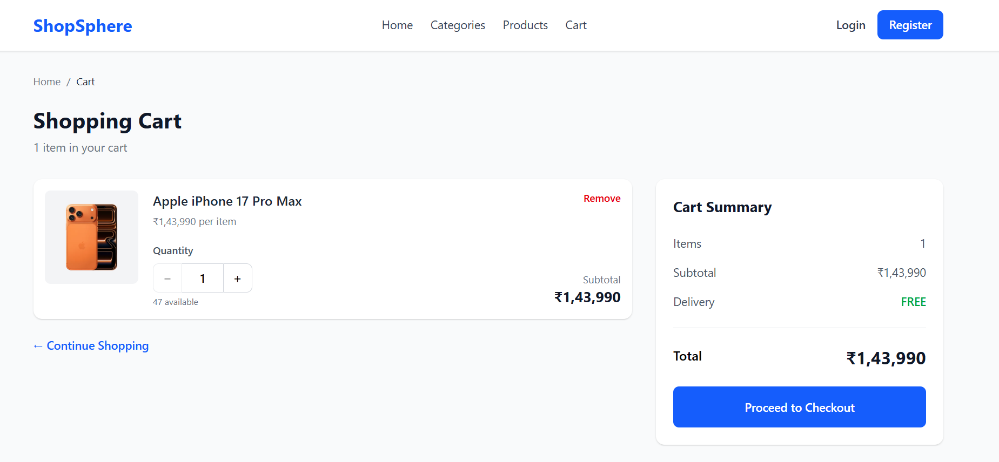
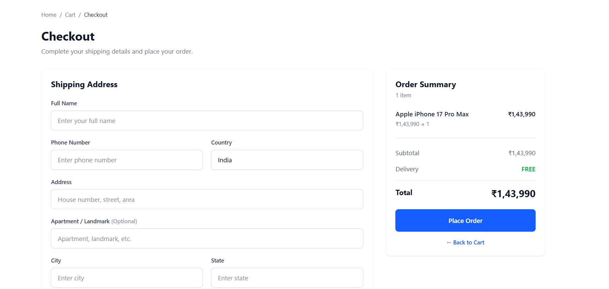
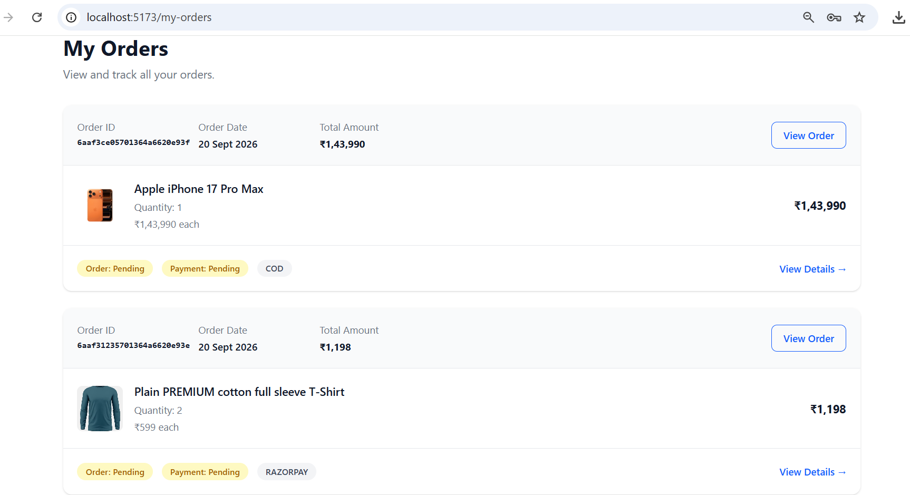
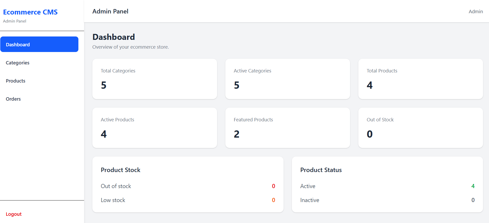
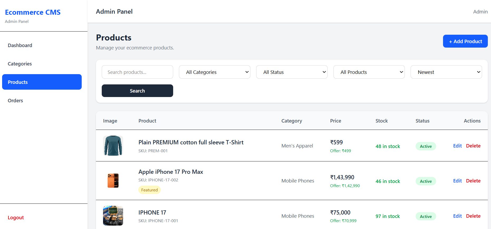
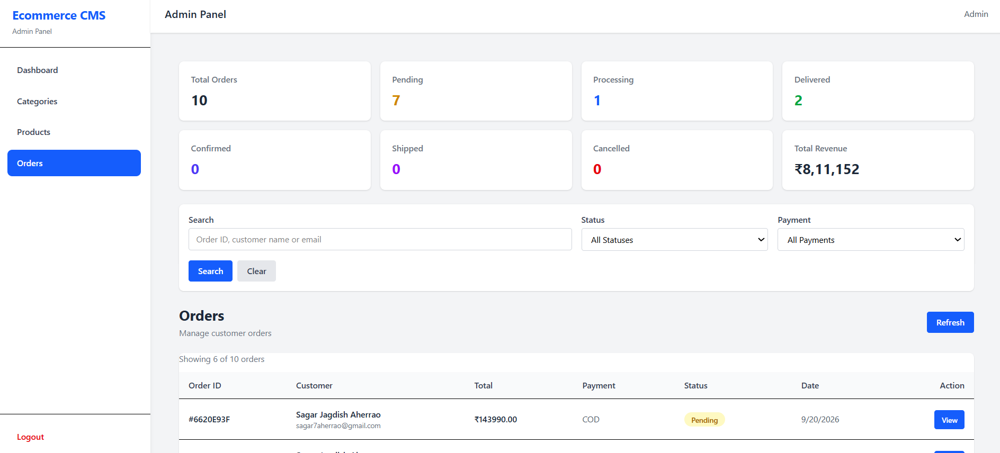

# 🛒 ShopSphere — MERN E-Commerce Platform

**ShopSphere** is a full-stack e-commerce web application built with the **MERN stack**, designed to provide a modern online shopping experience with customer authentication, product discovery, shopping cart, checkout, order management, and a dedicated admin management system.

The project demonstrates practical full-stack development concepts including **React, Node.js, Express.js, MongoDB, REST APIs, JWT authentication, role-based authorization, responsive UI, CRUD operations, search/filtering, pagination, and payment integration preparation**.

---

## 🚀 Project Overview

ShopSphere provides two primary experiences:

### 👤 Customer

Customers can:

* Register and log in securely
* Browse products
* Search products
* Filter products
* Sort products
* View product details
* Add products to cart
* Update cart quantities
* Proceed through checkout
* Place Cash on Delivery orders
* Manage their profile
* Manage multiple delivery addresses
* View their own orders
* View order details
* Log out securely

### 🔐 Admin

Administrators have access to a dedicated administration system for managing the e-commerce platform.

Admins can:

* View dashboard statistics
* Manage categories
* Create, update and delete products
* Upload multiple product images
* Manage product information
* View customer orders
* View individual order details
* Update order status
* Monitor real-time order statistics

---

# ✨ Key Features

## 🔐 Authentication & Authorization

* User registration
* User login
* JWT-based authentication
* Bearer token authentication
* Axios authentication interceptor
* Protected API routes
* Role-based authorization
* Customer and Admin roles
* Admin-only API access
* Secure logout

### Authorization Flow

```text
User
 │
 ├── Login
 │
 ▼
JWT Token
 │
 ▼
Axios Interceptor
 │
 ▼
Authorization: Bearer <token>
 │
 ▼
Express Middleware
 │
 ├── Authentication
 │
 └── Admin Authorization
 │
 ▼
Protected API
```

---

# 🛍️ Customer Features

## Product Browsing

Customers can browse the available product catalog with:

* Product listing
* Product details
* Product images
* Category information
* Product search
* Filtering
* Sorting
* Pagination

### Product Search & Filtering

The application supports:

```text
Search
   ↓
Category Filter
   ↓
Sort
   ↓
Pagination
   ↓
Product Results
```

This provides a scalable foundation for handling larger product catalogs.

---

# 🛒 Shopping Cart

The shopping cart allows customers to:

* Add products
* Remove products
* Update product quantity
* View cart items
* Calculate cart totals
* Continue to checkout

Cart functionality is integrated with the authenticated customer workflow.

---

# 📦 Checkout & Orders

ShopSphere provides an end-to-end order workflow.

### Current order flow

```text
Product
   ↓
Add to Cart
   ↓
Cart
   ↓
Checkout
   ↓
Delivery Address
   ↓
Payment Method
   ↓
Create Order
   ↓
Order Success
   ↓
My Orders
```

### Supported Payment Method

* Cash on Delivery (COD)

The project also includes preparation/integration for **Razorpay test-mode payments**.

---

# 📋 Order Management

Customers can:

* View their orders
* Open individual order details
* View order information
* Track the current order status

Customers are restricted to accessing their own order information through protected APIs.

---

# 👨‍💼 Admin CMS

ShopSphere includes an admin CMS for managing the e-commerce platform.

## Admin Dashboard

The dashboard displays real application statistics rather than static placeholder values.

Admin functionality includes:

* Dashboard statistics
* Product management
* Category management
* Order management
* Order status management

---

# 📦 Product Management

Admins can perform product CRUD operations:

```text
Create
Read
Update
Delete
```

Product management includes:

* Product name
* Description
* Price
* Category
* Product images
* Product information
* Product status/data management

The application supports **multiple product image uploads**.

---

# 🗂️ Category Management

Admins can:

* Create categories
* View categories
* Update categories
* Delete categories

Categories are integrated with product management and product filtering.

---

# 🚚 Admin Order Management

Admins can:

* View all orders
* View individual orders
* View order information
* Update order status

### Admin API

```text
GET    /admin/order
GET    /admin/order/:id
PATCH  /admin/order/:id/status
```

Order status management provides the foundation for the complete order fulfillment workflow.

---

# 📊 Admin Dashboard

The ShopSphere dashboard uses actual application data to display statistics.

The dashboard provides administrators with an overview of the platform's current activity, including order-related and product-related statistics.

---

# 🖼️ Product Image Management

The application supports multiple images for products.

This allows products to have more than one image for displaying different views and details.

The frontend dynamically renders product images received from the backend API.

---

# 🧑‍💻 Technology Stack

## Frontend

| Technology   | Purpose                |
| ------------ | ---------------------- |
| React        | Frontend UI            |
| Vite         | Frontend build tool    |
| Tailwind CSS | Responsive styling     |
| Axios        | HTTP/API communication |
| React Router | Client-side routing    |
| JavaScript   | Application logic      |

---

## Backend

| Technology | Purpose                     |
| ---------- | --------------------------- |
| Node.js    | Backend runtime             |
| Express.js | REST API framework          |
| MongoDB    | Database                    |
| Mongoose   | MongoDB ODM                 |
| JWT        | Authentication              |
| REST API   | Client/server communication |

---

## Development Tools

* Git
* GitHub
* MongoDB Compass
* Postman
* VS Code
* npm

---

# 🏗️ Project Architecture

ShopSphere follows a separate frontend/backend architecture.

```text
                    ┌─────────────────────┐
                    │      ShopSphere      │
                    └──────────┬──────────┘
                               │
                 ┌─────────────┴─────────────┐
                 │                           │
          ┌──────▼──────┐             ┌──────▼──────┐
          │   React     │             │  Express.js │
          │   Frontend  │◄───────────►│   Backend   │
          └──────┬──────┘   REST API  └──────┬──────┘
                 │                           │
                 │                           │
          ┌──────▼──────┐             ┌──────▼──────┐
          │ Tailwind CSS│             │   Mongoose  │
          └─────────────┘             └──────┬──────┘
                                             │
                                      ┌──────▼──────┐
                                      │   MongoDB    │
                                      └─────────────┘
```

---

# 📁 Project Structure

```text
shopsphere-mern-ecommerce/
│
├── client/
│   │
│   ├── public/
│   │
│   ├── src/
│   │   ├── components/
│   │   ├── pages/
│   │   ├── services/
│   │   ├── context/
│   │   ├── hooks/
│   │   └── ...
│   │
│   ├── package.json
│   └── ...
│
├── server/
│   │
│   ├── config/
│   ├── controllers/
│   ├── middleware/
│   ├── models/
│   ├── routes/
│   ├── uploads/
│   ├── package.json
│   └── ...
│
├── .gitignore
├── .env.example
└── README.md
```

> Directory names may vary slightly depending on the current implementation.

---

# 🔄 API Architecture

The backend exposes RESTful APIs for the major application modules.

```text
Authentication
      │
      ├── Register
      └── Login

Products
      │
      ├── List
      ├── Search
      ├── Filter
      ├── Sort
      └── Details

Categories
      │
      ├── List
      ├── Create
      ├── Update
      └── Delete

Orders
      │
      ├── Create
      ├── Customer Orders
      └── Order Details

Admin
      │
      ├── Products
      ├── Categories
      ├── Orders
      └── Dashboard
```

---

# 🔒 Security

ShopSphere implements several application-level security mechanisms:

* JWT authentication
* Bearer token authorization
* Protected routes
* Role-based access control
* Admin-only endpoints
* Customer-specific order access
* Environment variables for sensitive configuration

Sensitive configuration such as:

```text
MongoDB credentials
JWT secret
Razorpay credentials
```

should be stored in environment variables rather than committed to GitHub.

---

# ⚙️ Environment Configuration

Create the required environment files based on the provided `.env.example`.

Example:

```env
MONGO_URI=your_mongodb_connection_string
JWT_SECRET=your_jwt_secret

RAZORPAY_KEY_ID=your_razorpay_key_id
RAZORPAY_KEY_SECRET=your_razorpay_key_secret

PORT=5000
```

> Never commit real API keys, database credentials, JWT secrets, or other sensitive values to GitHub.

---

# 🛠️ Installation

## 1. Clone the Repository

```bash
git clone https://github.com/sagar-aherrao/shopsphere-mern-ecommerce.git
```

```bash
cd shopsphere-mern-ecommerce
```

---

# 📦 Backend Setup

Navigate to the backend:

```bash
cd server
```

Install dependencies:

```bash
npm install
```

Configure the environment variables.

Start the backend development server:

```bash
npm run dev
```

---

# 💻 Frontend Setup

Open another terminal and navigate to:

```bash
cd client
```

Install dependencies:

```bash
npm install
```

Start the Vite development server:

```bash
npm run dev
```

The frontend will then be available through the local Vite development URL displayed in the terminal.

---

# 🗄️ Database

ShopSphere uses **MongoDB** as its primary database.

Example database:

```text
shopsphere
```

The application uses **Mongoose** to define models and interact with MongoDB.

MongoDB can be run locally using MongoDB Community Server and managed using MongoDB Compass.

---

# 🧪 API Testing

Backend APIs can be tested using tools such as:

* Postman
* Thunder Client
* REST clients

Authentication-protected endpoints require a valid JWT Bearer token.

Example:

```http
Authorization: Bearer <JWT_TOKEN>
```

---

# 💳 Payment Integration

ShopSphere supports:

### Current

* Cash on Delivery

### Payment Integration

* Razorpay test-mode integration

The payment implementation is structured to support online payment processing while keeping sensitive Razorpay credentials in environment variables.

---

# 📱 Responsive Design

The frontend is designed using **Tailwind CSS** with responsive layouts for different screen sizes.

The application is intended to provide a consistent experience across:

* Desktop
* Laptop
* Tablet
* Mobile

---

# 📸 Screenshots

Screenshots can be added here as the project documentation is expanded.

## Customer Experience

### Home Page



### Product Listing



### Product Details



### Shopping Cart



### Checkout



### My Orders



---

## Admin Experience

### Admin Dashboard



### Product Management



### Order Management



> Add the corresponding screenshots to the `docs/` directory before enabling these images in the repository.

---

# 🧩 Main Application Modules

```text
┌───────────────────────────────────────┐
│              ShopSphere               │
├───────────────────────────────────────┤
│                                       │
│  Authentication                       │
│  ├── Registration                     │
│  ├── Login                            │
│  └── JWT Authorization                 │
│                                       │
│  Product Catalog                      │
│  ├── Products                         │
│  ├── Categories                       │
│  ├── Search                            │
│  ├── Filters                           │
│  ├── Sorting                           │
│  └── Pagination                        │
│                                       │
│  Shopping                             │
│  ├── Cart                             │
│  ├── Checkout                         │
│  └── Addresses                        │
│                                       │
│  Orders                               │
│  ├── Create Order                     │
│  ├── My Orders                        │
│  └── Order Details                    │
│                                       │
│  Admin CMS                            │
│  ├── Dashboard                        │
│  ├── Products                         │
│  ├── Categories                       │
│  └── Orders                           │
│                                       │
└───────────────────────────────────────┘
```

---

# 🎯 Learning & Engineering Objectives

This project was developed to demonstrate practical experience with:

* Full-stack MERN development
* RESTful API design
* React component architecture
* State and application flow management
* JWT authentication
* Role-based authorization
* MongoDB data modeling
* CRUD operations
* E-commerce workflows
* Shopping cart implementation
* Order processing
* Admin CMS development
* API integration
* Responsive UI development
* Product search and filtering
* Pagination
* Image handling
* Payment gateway integration
* Git/GitHub version control

---

# 🚧 Future Enhancements

The project can be extended with additional production-oriented capabilities, including:

* Razorpay production payment workflow
* Order email notifications
* Product reviews and ratings
* Wishlist
* Coupon/discount management
* Inventory management
* Advanced sales analytics
* Customer email verification
* Password reset
* Refresh-token based authentication
* Cloud image storage
* Automated testing
* CI/CD pipeline
* Production deployment
* Redis caching
* Advanced product recommendations

---

# 📌 Project Status

**Development Status:** Active Development

Current core functionality includes:

* ✅ Customer authentication
* ✅ JWT authorization
* ✅ Role-based access
* ✅ Product management
* ✅ Category management
* ✅ Product search
* ✅ Product filtering
* ✅ Product sorting
* ✅ Pagination
* ✅ Multiple product images
* ✅ Shopping cart
* ✅ Checkout
* ✅ Cash on Delivery
* ✅ Customer order management
* ✅ Admin dashboard
* ✅ Admin order management
* ✅ Order status management
* 🔄 Razorpay test-mode integration
* 🔄 Production deployment

---

# 👨‍💻 Author

## Sagar Aherrao

**Senior PHP Developer | Full Stack Web Developer | WordPress Developer**

Experienced in building web applications using PHP, WordPress, JavaScript, React and modern full-stack technologies.

### Connect

* GitHub: `https://github.com/sagar-aherrao`
* LinkedIn: `https://linkedin.com/in/sagar-aherrao-871658a6/`

---

# ⭐ Why ShopSphere?

ShopSphere is built as a practical full-stack application rather than a simple frontend demo.

It demonstrates an end-to-end e-commerce workflow:

```text
User Registration
       ↓
Authentication
       ↓
Product Discovery
       ↓
Search / Filter / Sort
       ↓
Product Details
       ↓
Shopping Cart
       ↓
Checkout
       ↓
Order Creation
       ↓
Customer Order Management
       ↓
Admin Order Management
       ↓
Order Status Updates
```

The project combines **frontend development, backend API development, database integration, authentication, authorization, e-commerce business logic and administrative functionality** into a single application.

---

## 📄 License

This project is intended primarily as a portfolio and learning project.

If you reuse or adapt the code, please provide appropriate attribution.
